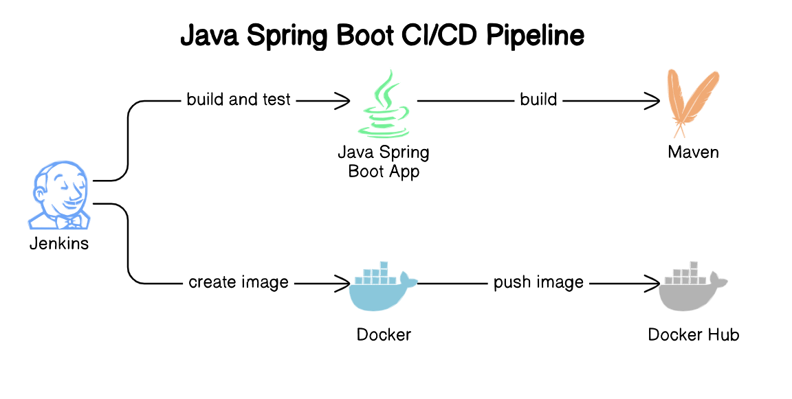

# Project Overview

[Project Link](https://github.com/elitekaycy/ci-jenkins)

This project showcases a CI/CD pipeline leveraging Jenkins for a Spring Boot application, with Docker for containerization. The pipeline automates the process of building, testing, and deploying the application. Below is a brief description of each component involved.

## Key Components
- **Docker**: Used to create a container for the Spring Boot application, ensuring consistency across environments.
- **Jenkins**: Manages the CI/CD pipeline, handling code checkout, builds, tests, and deployments.
- **Maven**: Utilized for building the Spring Boot application, managing dependencies, and executing tests.
Workflow
- **Code Checkout**: The pipeline pulls the latest code from a version control system (Git).
- **Build and Test**: The application is built using Maven, and unit tests are executed to ensure code quality.
- **Docker Image Creation**: A Docker image is built that contains the Spring Boot application JAR file.
- **Push to Docker Hub**: The newly created Docker image is pushed to Docker Hub for easy access and deployment.
- **Deployment**: The image can be deployed to any environment using Docker, allowing for easy scalability and management.

## Conclusion

This setup enables streamlined development and deployment processes, enhancing productivity and ensuring reliable application delivery.
